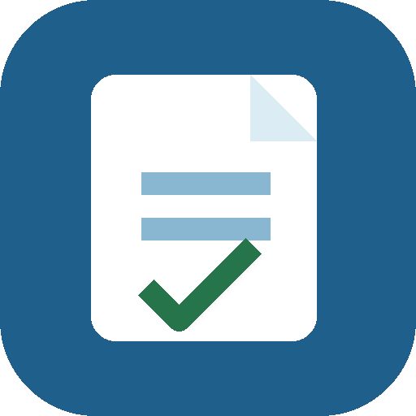

# Reporte

 

 

  

<strong>Registro quincenal de tiempo laborado.</strong>

 

Reporte es una aplicación web mobile-first para registrar jornadas por quincena desde el celular. Organiza automáticamente los días por semanas, calcula permanencia y horas laboradas, y genera el reporte final en Excel y PDF.

La información del trabajador y las jornadas se guarda localmente en el navegador del dispositivo. No requiere una cuenta ni una base de datos propia.

## Características

- Registro por semanas y días de cada quincena.
- Horarios en intervalos de 10 minutos.
- Almuerzo seleccionable entre 0 y 3 horas.
- Edición y eliminación de jornadas registradas.
- Cálculo automático de permanencia y horas laboradas.
- Transporte diario opcional y total automático cuando se utiliza.
- Campo obligatorio para confirmar los días de auxilio diario pactado.
- Historial reutilizable de proyectos o plantas para evitar escribirlos repetidamente.
- Nota adicional opcional, normalizada y destacada en negrilla en los documentos generados.
- Normalización de nombres y textos para mantener una presentación consistente.
- Firma del trabajador con nombre completo y firma del supervisor en blanco.
- Generación de un único Excel con la hoja `Reporte` y exportación a PDF.
- Guardado local, copia de seguridad e importación de datos.
- Diseño responsive optimizado para móvil y compatible con escritorio.
- Manifest y service worker para una experiencia instalable cuando el navegador lo permita.

## Tecnologías

- HTML5
- CSS3
- JavaScript
- ExcelJS
- jsPDF + AutoTable

## Autor y licencia

[Renzo Fernando Mosquera Daza](https://github.com/RenzoFernando)

Licencia MIT.
